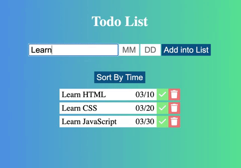

# Todo List App

This is a Todo-List app programmed with HTML/CSS/JavaScript.

1. User may open "index.html" to start an app.
2. User may enter description, month, and date to create a new item on todo list.
3. Completion button is toggle designed. User may click the button as the item is comepleted.
4. Sorting function is also designed. User may click the button to re-order the whole items in ascendance by comparing months and dates.
5. Deletion button can let user to remove an item from the list.
6. The list will be stored in local storage (in computer). Everytime when user opens the website, the todo list will be shown on the scree.

**_Start to organise your todo list and achieve a happy life!!!_**
